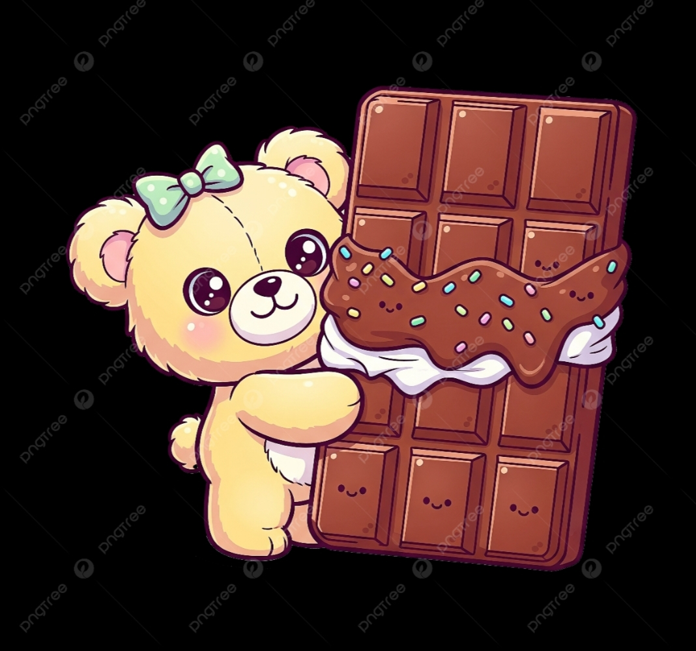

<!DOCTYPE html>
<html lang="en">
<head>
<meta charset="UTF-8">
<title>Happy Chocolate Day 💖</title>

<link href="https://fonts.googleapis.com/css2?family=Pacifico&family=Poppins:wght@300;500&display=swap" rel="stylesheet">

</head>

<body>

<!-- FIRST PAGE -->

  <h1>Happy Chocolate Day My Bacha 🍫💗</h1>

  

    You are sweeter than every chocolate in the world.  
    Every smile of yours melts my heart like warm cocoa.  
    Being with you makes my life soft, sweet, and full of love.
  

  

    I wish I could hand you chocolates right now…  
    but for now, I’m sending all my love wrapped in sweetness 💕
  

  
Click there for your chocolate 🍫👇

  
Click Here 💝

<!-- SECOND PAGE -->

  <h2>Yayyy Apka Chocolate Idhar Hai 🍫💖</h2>

  

  

    A chocolate for the cutest person in my life.  
    May your days always be this sweet and full of love.  
    You
